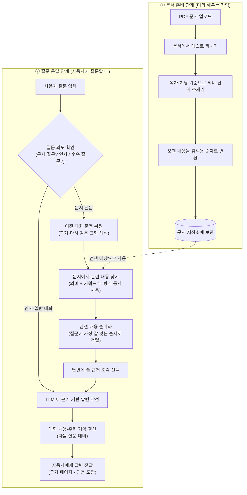

# RAG Task — OCP 문서 기반 멀티턴 질의응답 시스템

PDF 기술 문서를 읽고, 사용자의 질문에 **문서 근거와 함께** 답하는 RAG 시스템. LangChain / LlamaIndex 같은 RAG 프레임워크 없이 **문서 색인 · 검색 · 임베딩 · 멀티턴 세션 로직을 전부 직접 구현**했습니다.

> 발표 슬라이드는 [`README_PPT.md`](./README_PPT.md) 참고.

---

## 1. 한눈에 보는 파이프라인

시스템은 **① 문서 색인(오프라인)** 과 **② 질문 응답(온라인)** 두 단계로 구성됩니다.

<!-- 렌더된 이미지가 들어갈 영역 — 아래 mermaid 소스를 이미지(PNG/SVG)로 export 후 삽입 -->
<p align="center">
  
</p>

<details>
<summary><b>📋 Mermaid 소스 (클릭해서 펼치기 · 복사해서 사용)</b></summary>



Mermaid 소스를 이미지로 export 하려면 [Mermaid Live Editor](https://mermaid.live) 에 붙여넣고 `Actions → Export as PNG/SVG` 를 사용하거나, `mermaid-cli` 로 `mmdc -i pipeline.mmd -o docs/images/pipeline.png` 를 실행하세요.

</details>

### 단계별 풀이

**① 문서 준비 단계 (미리 해두는 작업)**

| 단계 | 설명 |
| :---: | --- |
| 1 | **PDF 문서 업로드** — 공식 OCP 문서와 고객사 매뉴얼 PDF 를 시스템에 넣습니다. |
| 2 | **텍스트 꺼내기** — PDF 안의 글자·표·코드를 페이지 단위로 추출합니다. |
| 3 | **의미 단위 쪼개기** — 목차·헤딩을 기준으로 "너무 길지도, 짧지도 않게" 조각냅니다. |
| 4 | **검색용 숫자로 변환** — 각 조각을 컴퓨터가 의미로 비교할 수 있는 숫자(벡터) 로 바꿉니다. |
| 5 | **저장소에 보관** — 조각 + 원문 + 숫자 벡터를 데이터베이스에 보관합니다. |

**② 질문 응답 단계 (사용자가 질문할 때마다 실행)**

| 단계 | 설명 |
| :---: | --- |
| 1 | **사용자 질문 입력** — 사용자가 채팅창에 질문을 적습니다. |
| 2 | **질문 의도 확인** — "문서 질문 / 인사 / 이어지는 질문" 중 무엇인지 판단합니다. |
| 3 | **대화 문맥 복원** — "그거 yaml 로 보여줘" 같이 생략된 주어를 이전 대화에서 복원합니다. |
| 4 | **관련 내용 찾기** — **의미**로 검색하는 방식과 **키워드**로 검색하는 방식을 동시에 써서 후보를 넓게 모읍니다. |
| 5 | **순위화** — 모인 후보를 질문에 가장 잘 맞는 순서로 다시 정렬합니다. |
| 6 | **근거 조각 선택** — 상위에서 답변에 실제로 쓸 조각만 골라냅니다. |
| 7 | **LLM 답변 작성** — 고른 근거를 LLM 에게 주고 사용자가 볼 답변을 만듭니다. |
| 8 | **대화 기억 갱신** — 이번 질문·답변의 주제를 기억해 다음 질문에 이어 쓸 수 있게 합니다. |
| 9 | **사용자에게 전달** — 근거 페이지·인용과 함께 실시간으로 화면에 출력합니다. |

---

## 2. 주요 기능

- **문서 색인**: PDF → 구조 마크다운 → 헤딩 기반 청킹 → BGE-M3 임베딩 → PostgreSQL
- **하이브리드 검색**: BGE-M3 dense cosine + BM25 sparse + RRF 결합 + BGE Cross-Encoder 리랭커
- **의도 라우팅**: `greeting · rag · general · clarification · step_navigation · unsupported_language` 를 LLM 기반 Agent(Intent/Retrieval/AnswerRewrite)로 분류
- **멀티턴 세션**: 최근 대화 · 주제 상태 · 인용 페이지 · 절차 단계(`step_cursor`) · 예시 앵커를 PostgreSQL 에 유지
- **버전 태그**: OCP 버전별로 색인을 분리하고, 질문 중 버전 언급을 자동 감지
- **OCP API Live 연동**: `oc get pod / yaml / events` 등을 실시간 REST 호출로 조회
- **Mixed 모드**: 문서 기반 답변 + 실제 OCP 결과를 한 답변에 자동 결합 ("공식 문서 기준" / "현재 OCP 기준")
- **Streaming**: FastAPI SSE 기반 토큰 스트리밍 + `status` 이벤트(검색 중 / OCP 조회 중) 실시간 표시

---

## 3. 기술 스택

| 영역 | 사용 기술 |
| --- | --- |
| Backend | FastAPI · uvicorn · Python 3.11+ |
| LLM | 사내 vLLM 엔드포인트 (`CLLM_BASE_URL`) · Qwen 계열 |
| Embedding | BGE-M3 (Ollama 또는 TEI 선택 가능) |
| Reranker | BGE cross-encoder (sentence-transformers) |
| Store | PostgreSQL (`pgvector/pgvector:pg16` 이미지 사용) |
| PDF 추출 | PyMuPDF (`fitz`) |
| Frontend | vanilla JS + SSE 기반 채팅 UI |
| Deploy | Docker Compose |

---

## 4. 로컬 설치 및 실행

### 4.1 Docker Compose (권장)

외부 LLM · OCP API 접속 정보만 준비되면 한 번에 실행됩니다.

```bash
# 1) 환경 변수 준비
cp .env.example .env
# → CLLM_BASE_URL / CLLM_MODEL / DB_* / OCP_API_* 값 채우기

# 2) 빌드 & 실행
docker compose up --build -d

# 3) 로그 확인
docker compose logs -f app
```

`docker-compose.yml` 구성:

| 서비스 | 역할 |
| --- | --- |
| `postgres` | 세션 · 작업 상태 · 벡터 · 청크 저장소 (`pgvector` 이미지) |
| `ollama` | BGE-M3 임베딩 서버 |
| `ollama-init` | 최초 실행 시 BGE-M3 모델 pull |
| `app` | FastAPI 서버 (포트 8000) |

확인 경로:

| URL | 설명 |
| --- | --- |
| http://localhost:8000 | 채팅 UI |
| http://localhost:8000/api/library | 색인 상태 |
| http://localhost:8000/docs | FastAPI Swagger |

PDF 는 `data/corpus/pdfs/` 에 넣거나 UI 에서 업로드하면 자동으로 백그라운드 색인됩니다.

### 4.2 Local (개발자 모드)

PostgreSQL 과 Ollama(또는 TEI) 가 이미 떠 있어야 합니다.

```bash
# Python 3.11+ 권장
python -m venv .venv

# Windows
.venv\Scripts\activate
# macOS / Linux
# source .venv/bin/activate

pip install -r requirements.txt

cp .env.example .env
# → DB_HOST / CLLM_BASE_URL / OLLAMA_BASE_URL 등 채우기

uvicorn app.main:app --reload --host 0.0.0.0 --port 8000
```

### 4.3 최초 색인

```bash
# PDF 넣기
cp /path/to/*.pdf data/corpus/pdfs/

# API 로 재색인 트리거 (UI 에서도 가능)
curl -X POST http://localhost:8000/api/reindex
```

서버 시작 시 미색인 문서는 자동 백그라운드 색인됩니다 (`STARTUP_AUTO_INDEX_ENABLED=true` 일 때).

---

## 5. 프로젝트 구조

```text
app/
  main.py                     # FastAPI 엔트리포인트
  app_factory.py              # 앱 생성 + startup hook
  dependencies.py             # AppContainer 조립 (싱글톤)
  config.py                   # .env 설정 로딩
  ocp_chat.py / ocp_client.py # OCP API 연동

  api/                        # HTTP 라우팅
    routes.py
    routes_chat.py
    routes_library.py
    routes_ocp.py
    routes_session.py
    routes_shared.py
    schemas.py

  llm/                        # LLM Agent
    intent_agent.py           # 의도 분류
    retrieval_agent.py        # 검색 질의 생성
    answer_rewrite_agent.py   # 답변 리라이트
    base_agent.py

  rag/                        # RAG 엔진 (핵심)
    pipeline.py               # RagPipeline orchestrator
    pipeline_scoring.py       # 점수화 Mixin
    pipeline_runtime_support.py
    pipeline_streaming.py
    ingestion_pdf.py          # PDF 텍스트 추출
    ingestion_pdf_extract.py
    chunking_markdown.py      # 헤딩 기반 청킹
    chunking_markdown_support.py
    bge_embeddings.py         # BGE-M3 (Ollama)
    bge_embedding_server.py   # BGE-M3 (TEI)
    index.py                  # VectorIndex
    indexing.py               # IndexingService
    retrieval.py              # HybridRetriever + BGEReranker
    retrieval_service.py
    retrieval_state_builder.py
    context.py                # 턴 컨텍스트 해석
    answer.py                 # 답변 생성
    answer_citation.py        # 인용 부착
    answer_format.py
    answer_inline_citation.py
    prompting.py              # 프롬프트 조립
    memory.py                 # 세션 메모리
    memory_schema.py
    version_manager.py        # OCP 버전 태그
    llm.py                    # LLM 클라이언트 (stream)
    cache.py                  # 파일 기반 캐시
    utils.py
    types.py

  session/                    # 대화 기록
    repository.py
    state.py
    store_sql.py

  storage/                    # 영속화
    cache_repository.py
    task_repository.py
    vector_store.py

  web/                        # 프론트엔드
    index.html
    js/
```

---

## 6. 시연 시나리오 (요약)

발표용 3 개 시나리오는 [`README_PPT.md`](./README_PPT.md) 에 슬라이드 형태로 정리되어 있습니다.

| # | 시나리오 | 핵심 확인 |
| :-: | --- | --- |
| 1 | **문서 + Follow-up** | 대명사 / 이어지는 질문을 주제 상태로 복원 |
| 2 | **OCP API 5턴** | 실제 cluster live 조회 + clarification |
| 3 | **Mixed / Compare 5턴** | 문서 RAG + live OCP 결과 자동 결합 |

### 6.1 시연용 권장 질문 순서

#### A. 문서 기반

1. `pod 확인하는 명령어 뭐야?`
2. `namespace 확인 명령어 뭐야?`
3. `yaml 보려면 무슨 명령어 써?`
4. `pod 확인하는 명령어 뭐야?`
5. `그거 yaml로 보려면?`

기대 포인트:
- `oc get pods`
- `oc project`
- `oc get <resource> <name> -o yaml`
- 답변 본문 inline source 표시
- 우측 preview 연동

#### B. OCP API 기반

1. `지금 pandas 관련 pod 보여줘`
2. `그쪽 yaml 파일 알려줘`
3. `build-and-push-crxvmo-build-image-pod 이거 yaml 알려줘`
4. `warning 이벤트 보여줘`
5. `demo namespace pod 몇개야?`

기대 포인트:
- 실제 live pod 조회
- ambiguous YAML follow-up clarification
- explicit pod name 입력 시 실제 YAML 응답

#### C. Mixed / Compare 기반

1. `pod 확인하는 명령어 뭐야?`
2. `그럼 지금 내 ocp 쪽 namespace에서는 어떻게 확인해`
3. `지금 pandas 관련 pod 보여줘`
4. `dev-pandas-bot-587d7d6465-cdffw 이거 yaml 알려줘`
5. `그 pod yaml이랑 공식 문서의 pod yaml은 뭐가 달라?`

기대 포인트:
- `문서 기준 명령어`
- `현재 OCP 결과`
- explicit pod name 지정 후 실제 YAML 응답
- compare 응답 시 `공식 문서 기준 / 현재 OCP 기준 / 비교 가이드`

### 6.2 고객사 메뉴얼 시연

고객사 메뉴얼은 startup auto index 여부와 무관하게 **업로드한 파일만 즉시 인덱싱**할 수 있습니다.

#### 업로드 방식

UI 에서 Library 업로드를 사용하거나, API 로 직접 업로드할 수 있습니다.

```bash
curl -X POST "http://localhost:8000/api/library/upload?target_group=customer_generated" \
  -F "files=@demo_customer_manual.md"
```

업로드 대상:
- `.md` → `generated/`
- `.pdf` → `generated_pdf/`

색인 완료 후에는 Library 목록에서 `document_group=customer_generated` 로 보입니다.

#### 시연용 샘플 메뉴얼

테스트용 샘플은 아래 경로에 포함되어 있습니다.

```text
tests/data/demo_customer_manual.md
```

샘플 메뉴얼 내용:
- `oc get pods -n demo | grep pandas`
- `oc get pods -n demo -o wide | grep pandas`
- `oc get pod <pod_name> -n demo -o yaml`
- `oc describe pod <pod_name> -n demo`
- `oc get events -n demo --field-selector type=Warning`

#### 고객사 메뉴얼 시연용 권장 질문

아래 질문은 실제로 고객사 메뉴얼 근거로 응답되는 흐름을 확인했습니다.

1. `고객사 메뉴얼 기준으로 pandas 운영 점검 절차 알려줘`
2. `고객사 메뉴얼 기준으로 pandas 관련 pod 상태 확인 명령어 알려줘`
3. `고객사 메뉴얼 기준으로 특정 pod yaml 확인 명령어 알려줘`
4. `고객사 메뉴얼 기준으로 warning 이벤트 확인 명령어 알려줘`

#### 시연 시 주의사항

- `고객사 메뉴얼 기준으로` 라는 문구를 포함하면 customer-generated 문서 우선도가 높아집니다.
- 시연용으로는 **고객사 메뉴얼 단독 질문**이 가장 안정적입니다.
- `공식 문서와 고객사 메뉴얼 비교` 같은 mixed customer/manual 질문은 문구에 따라 흔들릴 수 있으므로, 발표 현장에서는 단독 메뉴얼 질문을 우선 권장합니다.

---

## 7. 환경 변수

`.env.example` 참고. 주요 항목:

| 변수 | 설명 |
| --- | --- |
| `CLLM_BASE_URL` · `CLLM_MODEL` | LLM 엔드포인트 · 모델명 |
| `DB_HOST` · `DB_PORT` · `DB_NAME` · `DB_USER` · `DB_PASSWORD` | PostgreSQL |
| `EMBEDDING_BACKEND` | `tei` 또는 `ollama` |
| `TEI_BASE_URL` · `TEI_EMBEDDING_MODEL` | TEI 사용 시 |
| `OLLAMA_BASE_URL` · `OLLAMA_EMBEDDING_MODEL` | Ollama 사용 시 |
| `OCP_API_BASE_URL` · `OCP_API_TOKEN` · `OCP_DEFAULT_NAMESPACE` | OCP REST API |
| `RAG_SOURCE_DIR` · `RAG_CACHE_DIR` · `RAG_EXTRACT_DIR` | 경로 |
| `RAG_STRUCTURED_CHUNK_SIZE` · `_OVERLAP` · `_MIN_CHARS` | 청킹 파라미터 |
| `STARTUP_AUTO_INDEX_ENABLED` | 기동 시 자동 색인 여부 |

---

## 8. 로드맵

- 테스트 데이터 기반 검색 가중치 자동 튜닝
- Tokenizer-aware chunk sizing (모델 입력 길이 직접 반영)
- 버전 간 차이 비교 UI
- 페이지 경계(표 · 코드 · YAML) 복원 품질 강화
- Selection policy 추가 분리 (도메인 서비스화)
- retrieval acceptance / chunking 전략 / follow-up 전후 실험 로그 정리

---

## 9. 참고

- 발표 슬라이드 : [`README_PPT.md`](./README_PPT.md)
