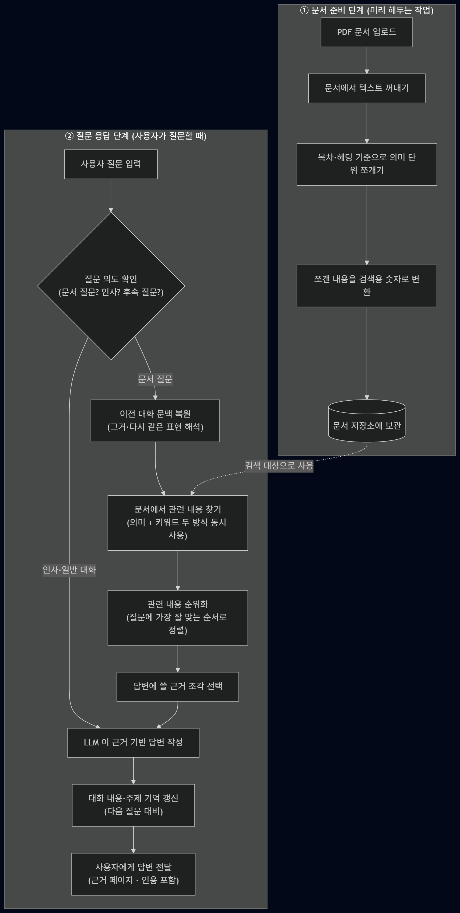
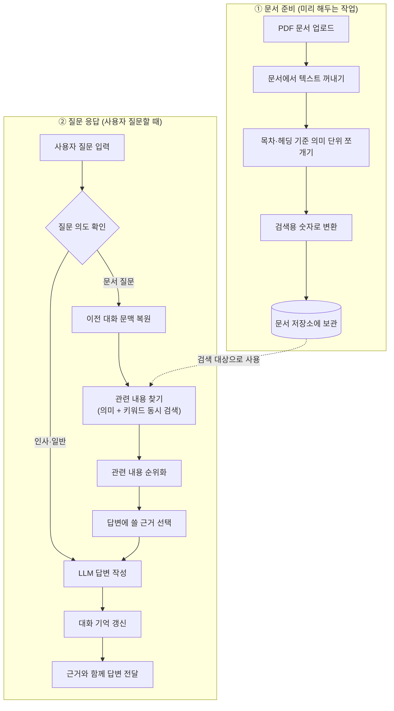

<!--
  README_PPT.md — 발표용 슬라이드
  ────────────────────────────────────────────────
  · GitHub 에서 열면 `---` 가로줄로 슬라이드가 자연스럽게 구분됩니다.
  · 실제 슬라이드로 보려면 README_PPT.pdf / README_PPT.pptx 사용.
  · 재빌드: npx @marp-team/marp-cli README_PPT.md --pdf --allow-local-files
-->


<!-- _class: lead -->
<!-- _paginate: false -->
<!-- _header: "" -->
<!-- _footer: "" -->

# RAG Task
## OCP 문서 기반 멀티턴 질의응답 시스템

프레임워크 없이 직접 구현한 Retrieval-Augmented Generation

`2026-04-13` · 발표자: **김준규**

<br>

> 📑 **슬라이드로 보기 (GitHub):** [README_PPT.pdf](./README_PPT.pdf) · [README_PPT.pptx](./README_PPT.pptx)

---

## 1. 배경 — 우리가 풀고 싶은 문제

- 고객사는 **Openshift Container Platform(OCP)** 를 운영하지만, 공식 문서와 실제 운영 매뉴얼은 매번 따로 찾아봐야 함.
- "명령어 뭐였지?", "yaml 어떻게 생겼지?" 같은 질문에 답하려면 **여러 PDF 를 뒤적여야 하는 상황**.
- 실제 운영 상태(`oc get pod`, 이벤트, YAML)는 **"지금 이 순간"** 의 정보가 필요 — 문서만으로는 부족.
- 기존 RAG 프레임워크(LangChain/LlamaIndex) 는 내부 동작이 블랙박스 → **현업 요구사항 맞춤 제어가 어려움**.

---

## 2. 목표

1. **문서 기반**으로 질문에 답하되, 근거 페이지·인용을 항상 노출.
2. **멀티턴**으로 "그거 yaml 로 보여줘" 같은 이어지는 질문도 이해.
3. **Live OCP API** 와 결합해서 문서 예시 + 실제 cluster 결과를 **한 답변에 결합**.
4. RAG 프레임워크 없이 **색인·검색·임베딩·세션을 직접 구현** — 모든 로직이 코드로 드러남.

---

## 2-a. 구축 의도 — Why a Custom RAG?

> **"OpenShift Lightspeed의 가치를, 폐쇄망 보안 등급으로."**

- **레퍼런스**: Red Hat **OpenShift Lightspeed (OLS)** — 자연어로 OCP 질문에 답하는 AI 어시스턴트
- **그러나 공공·금융 등급 환경에는 그대로 도입할 수 없음**
  - 외부 LLM(OpenAI 등) 호출 → **망분리 위반**
  - 질의·로그 외부 전송 → **데이터 주권 침해**
  - Red Hat 관리형 SaaS → **내부 매뉴얼 통합·감사·튜닝 한계**
- **결론**: 같은 효용을 **100% 폐쇄망에서 자체 운영**하도록 다시 설계 → **본 시스템**

---

## 2-b. OpenShift Lightspeed 대비 차별성

| 구분 | OpenShift Lightspeed | **본 시스템** |
| --- | --- | --- |
| **운영 환경** | 외부 LLM / SaaS 의존 | **완전 폐쇄망** — 사내 vLLM · BGE-M3 · PostgreSQL |
| **데이터 주권** | 외부 트래픽 발생 | **외부 트래픽 0** — 모든 로그 기관 내부 잔존 |
| **모델 종속성** | Red Hat 지정 모델 | **모델 교체 자유** — Qwen / Llama / 사내 sLLM |
| **문서 범위** | Red Hat 공식 문서 위주 | **공식 문서 + 내부 운영 매뉴얼 통합 색인** |
| **버전 관리** | 단일 버전 가정 | **OCP 버전별 색인 분리 + 자동 인식** |
| **검색 품질** | 프레임워크 블랙박스 | **자체 Hybrid Retrieval** (Dense + BM25 + RRF + Cross-Encoder) |
| **멀티턴** | 단발 Q&A 중심 | **topic state · step cursor 기반 후속 질문 복원** |
| **검증성** | 출처 표시 제한적 | **문장 단위 인용 + 페이지 미리보기** → 감사 대응 가능 |
| **클러스터 연동** | 문서 답변 위주 | **OCP API Live + Mixed 모드** ("문서 기준" + "현재 cluster 기준") |
| **배포 · 인수** | Red Hat 종속 패키지 | **Docker Compose 한 줄 + 코드 100% 공개** → 운영팀 직접 인수 가능 |

> **"프레임워크 의존 없이 직접 구현 — 그래서 폐쇄망 안에서 끝까지 책임질 수 있습니다."**

---

## 3. 아키텍처 한눈에 보기

<p align="center">
  
</p>

- **Backend**: FastAPI · PostgreSQL · BGE-M3
- **LLM**: 사내 vLLM (Qwen 계열)
- **실행**: `docker compose up --build -d` 한 줄

---

## 4. 파이프라인 — Mermaid 소스



---

## 5. 핵심 기술 스택

| 영역 | 기술 |
| --- | --- |
| **색인** | PyMuPDF · 헤딩 기반 청킹 · BGE-M3 임베딩 |
| **검색** | BGE-M3 Dense + BM25 Sparse + **RRF 융합** + BGE Cross-Encoder Reranker |
| **의도** | LLM Agent 3 종 (`IntentAgent` · `RetrievalAgent` · `AnswerRewriteAgent`) |
| **세션** | PostgreSQL 기반 topic state · step cursor · example anchor |
| **실시간** | OCP REST API (`/api/v1/namespaces/...`) 직접 호출 |
| **Stream** | FastAPI SSE + `status` 이벤트 (검색 중 / OCP 조회 중) |

---

## 6. 시연 ① — 문서 + Follow-up

### 🎯 상황
기술 엔지니어가 OCP 매뉴얼을 처음 보며 명령어를 순차적으로 확인하는 흐름.

### 🎯 목표
- 대명사 · 이어지는 질문을 이전 turn 의 주제 상태로 **자동 복원**.
- 모든 답변에 **source 태그 + preview 페이지** 가 인라인으로 부착되는지 확인.

### 💬 질문 흐름 (5 turn)
1. `namespace 확인 명령어 뭐야?`
2. `pod 확인하는 명령어 뭐야?`
3. `yaml 보려면 무슨 명령어 써?`
4. `pod 확인하는 명령어 뭐야?`
5. `그거 yaml로 보려면?`

---

## 6-a. 시연 ① — 확인 포인트

- ✅ `oc project`, `oc projects`
- ✅ `oc get pods`, `oc get pods -o wide`
- ✅ `oc get pod <pod_name> -o yaml`, `oc describe pod <pod_name>`
- ✅ **인라인 source 태그** + **preview 페이지** 연결
- ✅ 5 턴에서 대명사 `"그거"` 가 직전 resource (pod) 로 자동 resolve
- ✅ 각 답변의 근거 chunk 가 preview 우측 패널에서 하이라이트

---

## 7. 시연 ② — OCP API 기반 5턴

### 🎯 상황
운영 담당자가 실제 cluster 상태를 **live 로 조회**.

### 🎯 목표
- 문서 RAG 대신 **OCP REST API 라우팅**이 트리거되는지 확인.
- ambiguous 질문은 clarification 요구, explicit pod name 은 실제 YAML 반환.

### 💬 질문 흐름 (5 turn)
1. `지금 pandas 관련 pod 보여줘`
2. `그쪽 yaml 파일 알려줘`
3. `build-and-push-crxvmo-build-image-pod 이거 yaml 알려줘`
4. `warning 이벤트 보여줘`
5. `현재 demo namespace pod 몇개야?`

---

## 7-a. 시연 ② — 확인 포인트

- ✅ `pandas` pod live 조회 성공 (실제 pod 목록 반환)
- ✅ `그쪽 yaml` → ambiguous → **clarification 요구**
- ✅ explicit pod name 지정 시 **실제 YAML 전체** 반환
- ✅ `warning 이벤트` → `type=Warning` 필터링된 이벤트만 표시
- ✅ `몇개야?` → **pod count 집계** (숫자로 응답)
- ✅ 각 답변 route 가 `ocp_live` / `ocp_yaml` / `ocp_event` 로 분류

---

## 8. 시연 ③ — Mixed / Compare 5턴

### 🎯 상황
문서 기반 설명과 실제 cluster 결과를 **한 답변에 동시에** 요구하는 고난도 시나리오.

### 🎯 목표
- 단일 질문에서 **문서 RAG + live OCP API** 를 자동으로 결합하는 `mixed` 라우팅 검증.
- 비교 요청(`뭐가 달라?`)일 때 `공식 문서 기준` / `현재 OCP 기준` 두 섹션으로 분리.

### 💬 질문 흐름 (5 turn)
1. `pod 확인하는 명령어 뭐야?`
2. `지금 pandas 관련 pod 보여줘`
3. `그 yaml 보여줘`
4. `현재 상태 확인 명령어랑 실제 결과 같이 알려줘`
5. `그 pod yaml이랑 공식 문서의 pod yaml은 뭐가 달라?`

---

## 8-a. 시연 ③ — 확인 포인트

- ✅ 1턴: 순수 문서 RAG → `oc get pods` 답변
- ✅ 2턴: live OCP → pandas pod 실제 목록
- ✅ 3턴: follow-up resource 추적 (`pandas pod` → `그 yaml`)
- ✅ 4턴: `mixed` 라우팅 → `문서 기준 명령어` + `현재 OCP 결과` 결합
- ✅ 5턴: **compare 모드** → `공식 문서 기준` / `현재 OCP 기준` / `비교 가이드` 3 섹션으로 구조화
- ✅ `answer_route = "mixed_doc_ocp"` 플래그가 payload 에 부착

---
## 9. 시연 ④ — 고객사 문서 업로드 (Custom Onboarding)

### 🎯 상황
신규 고객사가 자사 **내부 운영 매뉴얼 PDF** 를 시스템에 직접 올리고, 곧바로 질의응답에 활용하는 시나리오.

### 🎯 목표
- 웹 UI 에서 PDF 업로드 → **자동 색인 파이프라인** (extract → chunk → embed → store) 가 한 번에 동작.
- 색인 진행 상태가 **SSE 로 실시간 노출**되고, 완료 즉시 새 문서 기반 답변 가능.
- 별도 재배포·재시작 없이 **문서 라이브러리 hot-reload**.

### 💬 시연 흐름 (5 step)
1. `Library` 탭 → **PDF 업로드** 버튼 → 고객사 운영 매뉴얼 선택
2. 진행 상태 `extracting → chunking → embedding → indexed` 단계별 표시
3. 라이브러리 패널에 신규 문서가 **페이지 수 · chunk 수** 와 함께 등록되는 것 확인
4. 채팅창에서 **신규 문서 한정 질문** 입력 → 인용 출처가 방금 올린 PDF 로 표시
5. 이어서 **기존 OCP 매뉴얼 질문** → 기존/신규 문서 **동시 검색**까지 검증

---

## 9-a. 시연 ④ — 확인 포인트

- ✅ 업로드 즉시 `task_id` 발급, SSE 로 단계별 progress 스트리밍
- ✅ `IndexingService` 가 PyMuPDF 추출 → 헤딩 기반 청킹 → BGE-M3 임베딩 → PostgreSQL 저장
- ✅ **인덱스 hot-reload**: 색인 완료 직후 다음 질문부터 신규 chunk 가 후보군에 포함
- ✅ 인용 출처에 **신규 문서명 + 페이지 번호** 노출, preview 패널에서 원문 즉시 확인
- ✅ 기존 OCP 색인과 **충돌 없이 공존** — `version_tag` 단위로 분리 저장
- ✅ 추출 실패 PDF (스캔본 등) 는 **명시적 에러 메시지** + 부분 색인 방지
- ✅ 운영자가 **재배포 없이** 고객사별 매뉴얼을 셀프서비스로 추가 가능

---

## 10. 로컬 설치

```bash
# 1) 환경 변수 준비
cp .env.example .env
# → CLLM_* / DB_* / OCP_API_* 값 채우기

# 2) 실행
docker compose up --build -d
```

| URL | 설명 |
| --- | --- |
| http://localhost:8000 | 채팅 UI |
| http://localhost:8000/api/library | 색인 상태 |
| http://localhost:8000/docs | FastAPI Swagger |

- PDF 는 `data/corpus/pdfs/` 에 넣거나 UI 에서 업로드 시 자동 색인.

---

## 11. 기술적 하이라이트

- **프레임워크 zero** — 색인 · 검색 · 리랭킹 · 세션 · 멀티턴 로직 전부 직접 구현.
- **3-signal hybrid retrieval** — dense cosine + BM25 + RRF 융합 후 Cross-Encoder 재정렬.
- **LLM Agent 기반 의도 분류** — 하드코딩 키워드 매칭 최소화, 사내 LLM 만으로 동작.
- **주제 상태 기반 멀티턴** — 단순 history 전달이 아닌 `topic state` 를 매 턴 갱신.
- **Mixed 모드** — 문서 RAG 와 live OCP API 를 한 응답에 자동 결합.
- **버전 태그** — OCP 버전별 색인 분리 · 질문 내 버전 언급 자동 감지.

---

## 12. 로드맵

- 테스트 데이터 기반 **검색 가중치 자동 튜닝**
- **Tokenizer-aware chunk sizing** (모델 입력 길이 직접 반영)
- **버전 간 차이 비교 UI**
- 페이지 경계(표 · 코드 · YAML) **복원 품질 강화**
- **Selection policy 분리** (도메인 서비스화)
- retrieval acceptance · chunking 전략 · follow-up 전후 **실험 로그 정리**

---

<!-- _class: lead -->

# 감사합니다

**질문 환영합니다.**

- 📖 상세 문서: [`README.md`](./README.md)
- 💻 Repo: `RAG_Task`
